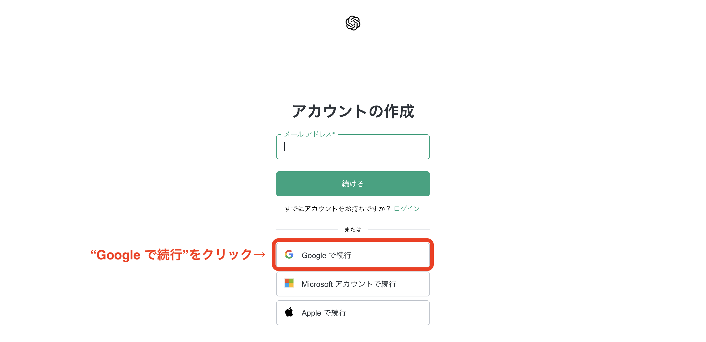
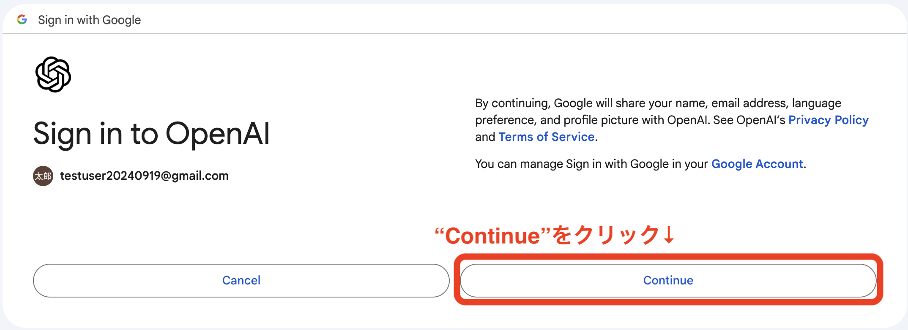
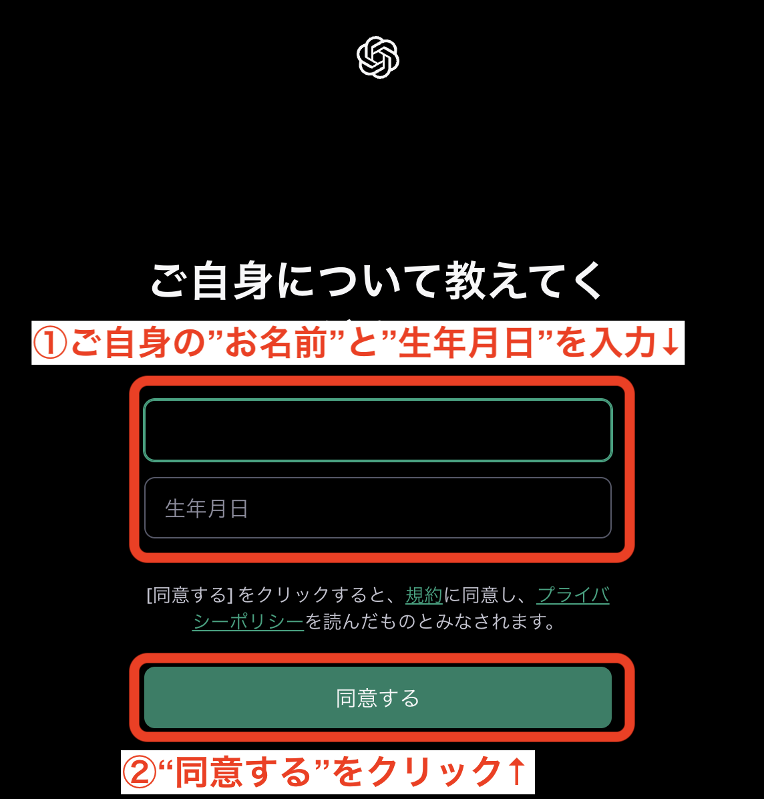
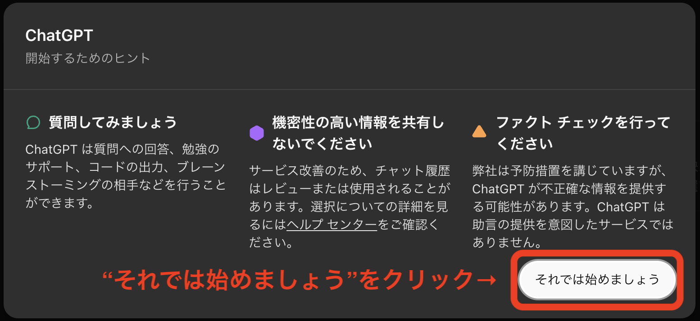
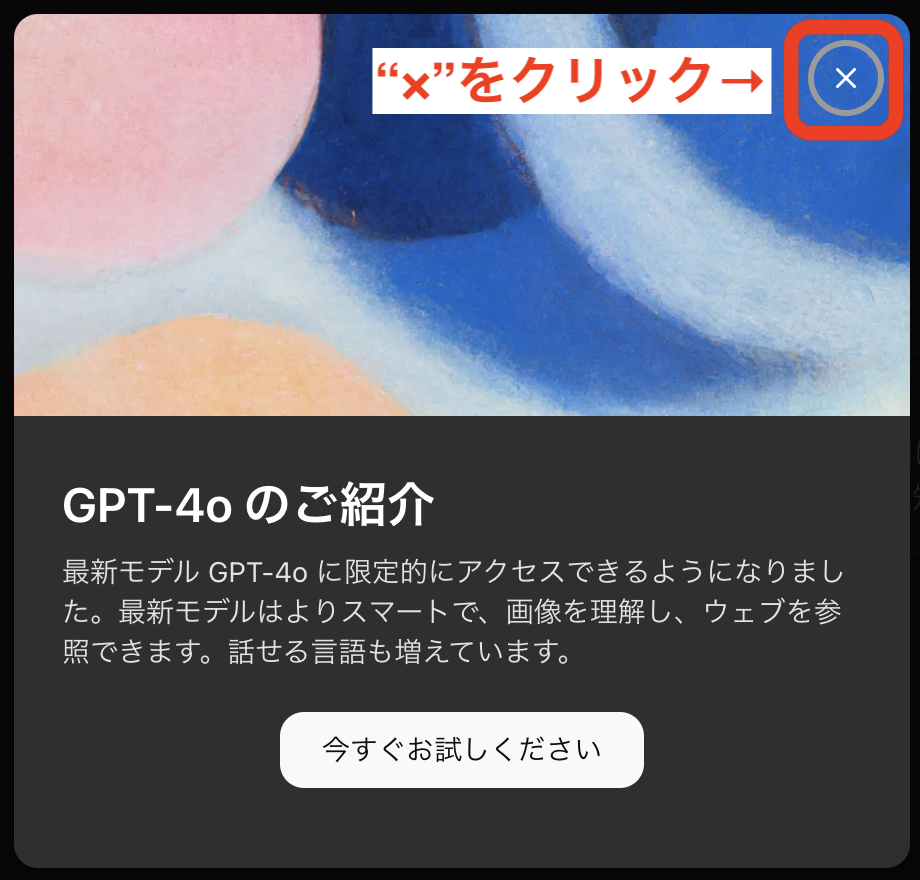
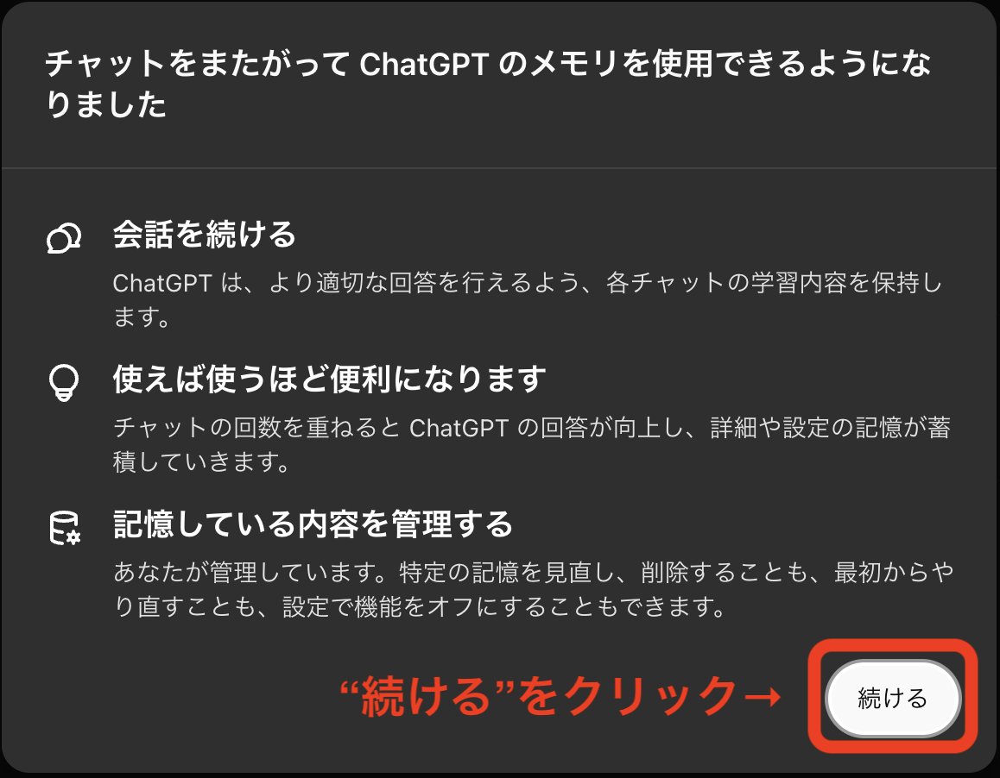

# ChatGPTへの接続確認とサインアップ

## 接続確認

* ChatGPT Webサイト (https://openai.com/chatgpt/) へアクセス

* "Start now"をクリック

* 以下の画面が表示されることを確認

そのままの画面で、サインアップの手順を実施してください

## サインアップ

### 画面を閉じてしまった場合は以下の手順を再度実施してください

* ChatGPT Webサイト (https://openai.com/chatgpt/) へアクセス

* "Start now"をクリック

### 接続確認からの続きの方は以下の手順から実施してください

* "サインアップ"をクリック

* "Google で続行"をクリック

* ご自身のアカウントをクリック

* "Continue"をクリック

* ① ご自身の"お名前"と"生年月日"を入力
* ② 規約とプライバシーポリシーを確認し、"同意する"をクリック

* "それでは始めましょう"をクリック

* 右上の"❌"をクリック

* "続ける"をクリック

* 以下のような画面が表示されれば、サインアップ完了です

[事前準備 トップへ戻る](./preparation.md)
