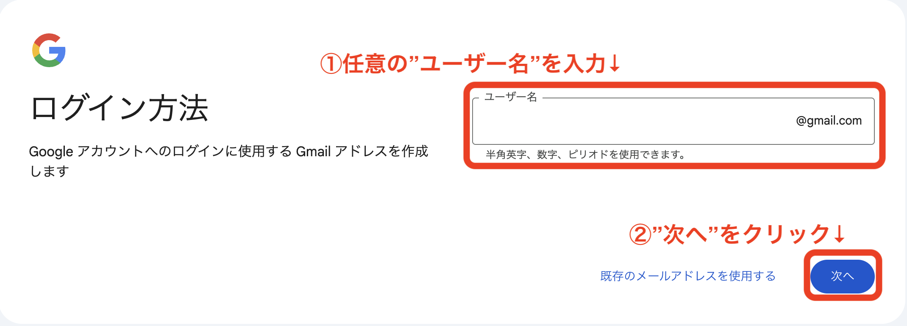
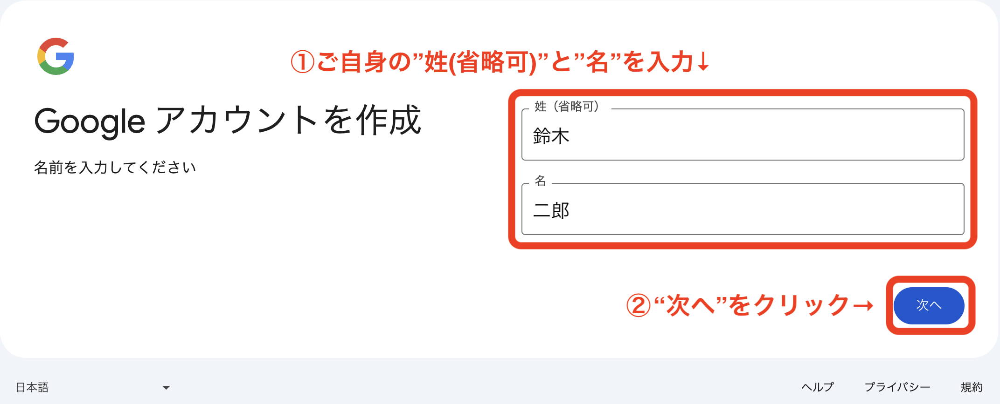

# Googleアカウントの作成

## すでにGoogleアカウントをお持ちの方

準備していただく必要はございません。  
現在のアカウントとは別でアカウントを準備したい方は  
ページ下部にあります、<ins>**すでにGoogleアカウントをお持ちで、別のアカウントを作成したい方**</ins>をご覧いただき、  
事前準備を進めていただければと存じます。

## Googleアカウントをお持ちでない方

* GoogleのWebサイト(https://www.google.com/) へアクセス
* 右上の"ログイン"をクリック

* "アカウント作成"をクリック

* "個人で使用"をクリック

* "姓(省略可)"と"名"を入力し、"次へ"をクリック

* "生年月日"と"性別"を入力し、"次へ"をクリック

* "ユーザー名"を入力し、"次へ"をクリック

  * 他と重複している場合は別のものにする必要があり
  * 後で変更できないため注意
* "パスワード"を入力し、"次へ"をクリック

* "電話番号"を入力し、"次へ"をクリック

* 前の手順で入力した電話番号のSMSに送られてきた"コード"(6桁の数字)を入力し、次へをクリック

* "スキップ"をクリック

* "次へ"をクリック

* 利用規約とプライバシーポリシーを確認し、"同意する"をクリック

## すでにGoogleアカウントをお持ちで、別のアカウントを作成したい方

* GoogleのWebサイト(https://www.google.com/)へアクセス
* 右上の"ログイン"をクリック

* "ご自身のアカウント"をクリック

* "ご自身のパスワード"を入力し、"次へ"をクリック

* 以下の画面が表示された場合は"後で"をクリック

* 以下の画面が表示された場合は "後で行う"をクリック

* "ご自身のアカウントのアイコン"をクリック

* "アカウントを追加"をクリック

* "アカウント作成"をクリック

* "個人で使用"をクリック

* "姓(省略可)"と"名"を入力し、"次へ"をクリック

* "生年月日"と"性別"を入力し、"次へ"をクリック

* "自分でGmailアドレスを作成"をクリック

* "ユーザー名(Gmailアドレス)"を入力し、"次へ"をクリック

* "パスワード"を入力し、"次へ"をクリック

* "スキップ"をクリック

* "次へ"をクリック

* 利用規約とプライバシーポリシーを確認し、"同意する"をクリック

