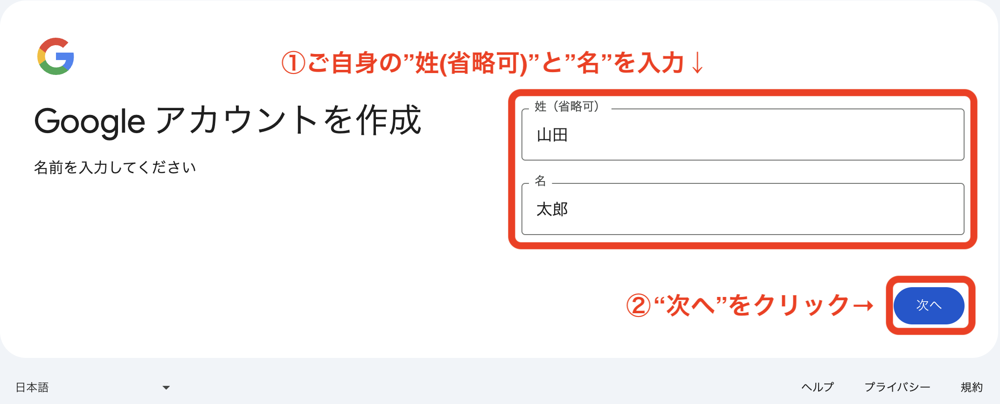
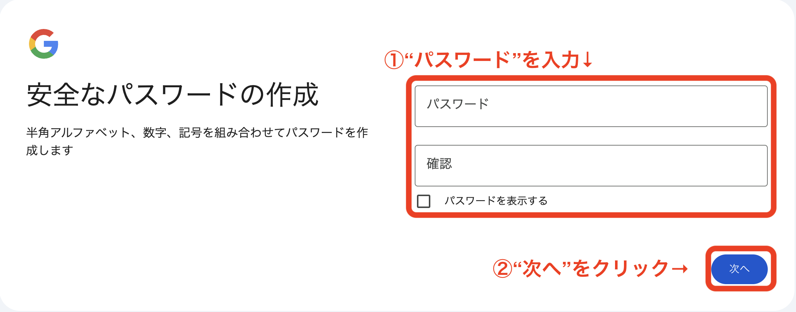
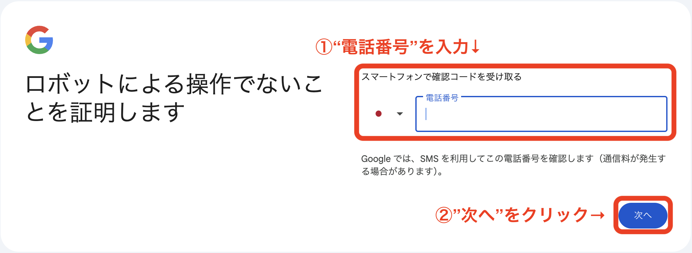
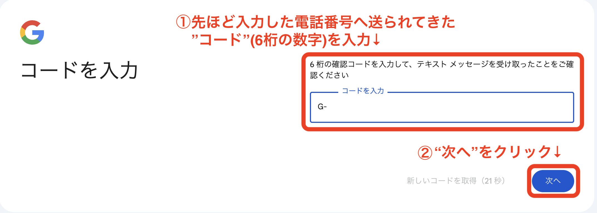

# Googleアカウントをお持ちでない方

## Googleアカウント作成手順

* GoogleのWebサイト(https://www.google.com/) へアクセス
* 右上の"ログイン"をクリック

* "アカウント作成"をクリック

* "個人で使用"をクリック

* ご自身の"姓(省略可)"と"名"を入力し、"次へ"をクリック

* "生年月日"と"性別"を入力し、"次へ"をクリック

* 任意の"ユーザー名"を入力し、"次へ"をクリック
  * 他と重複している場合は別のものにする必要があり
  * 後で変更できないため注意

* "パスワード"を入力し、"次へ"をクリック

* "電話番号"を入力し、"次へ"をクリック

* 前の手順で入力した電話番号のSMSに送られてきた"コード"(6桁の数字)を入力し、次へをクリック

* "スキップ"をクリック

* "次へ"をクリック

* 利用規約とプライバシーポリシーを確認し、"同意する"をクリック

* 以上で登録完了です。当日利用しますので、"ユーザー名(メールアドレス)"と"パスワード"を忘れずにおいてください。

[2. 利用予定サービスへの接続確認](./preparation.md) へ
