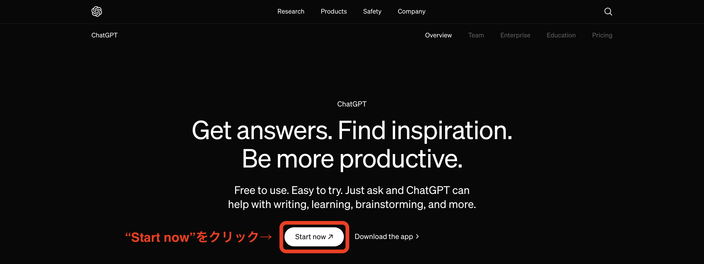
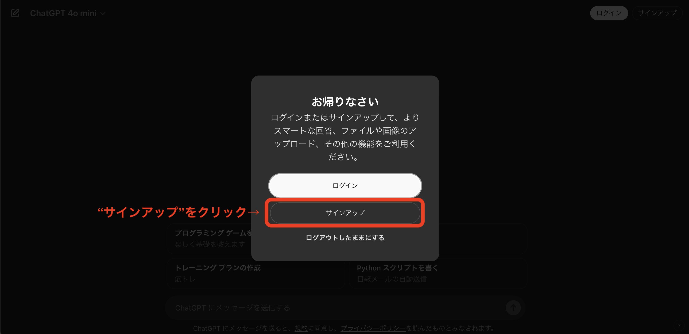

# 事前準備

1. Googleアカウント作成
2. 利用予定サービスへの接続確認

## 1. Googleアカウント作成

### Googleアカウントをお持ちでない方

[Googleアカウント作成手順](./NewGoogleAccount.md)を参考にGoogleアカウントの作成をお願いします

### すでにGoogleアカウントをお持ちの方

新しく作成していただく必要はございません

現在のアカウントとは別でアカウントを準備したい方は  
[すでにGoogleアカウントをお持ちで、別のアカウントを作成したい方](./OtherGoogleAccount.md)を参考に 
Googleアカウントの作成をお願いします

## 2. 利用予定サービスへの接続確認

### ChatGPT

以下の手順を実施し、接続可能かご確認をお願いします

* ChatGPT Webサイト (https://openai.com/chatgpt/) へアクセス
* "Start now"をクリック

* 以下の画面が表示されることを確認

